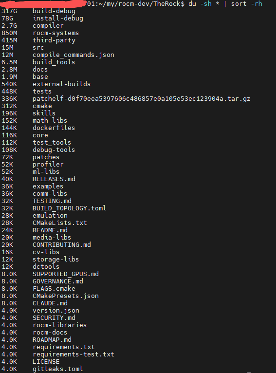

.. meta::
   :description: 初探 TheRock 工具
   :keywords: TheRock, ROCm, 构建, 发布，持续集成

##############################
TheRock--rocm构建工具
##############################

TheRock 介绍
==================

**TheRock 是 ROCm 的统一构建与发布项目**，全称是 **The HIP Environment and ROCm Kit**。可以把它理解为 ROCm 的“组装工厂”：把编译器、HIP 运行时、数学库等组件整合起来，统一编译、测试和打包。 `官方仓库 <https://github.com/ROCm/TheRock>`_。

它主要解决三个问题：

- **简化编译**：通过 CMake 统一管理多个组件及其依赖，减少逐个配置和编译的工作。
- **方便定制**：可以选择需要的组件和目标 GPU 架构，例如只构建某款显卡需要的 HIP 和数学库。
- **方便获取和验证新版本**：提供 ROCm、PyTorch 的每日构建，并支持在多种 Linux 发行版和原生 Windows 上构建，也支持从源码构建使用 ROCm 的 PyTorch、JAX。 `功能与构建说明 <https://github.com/ROCm/TheRock#features>`_。

**它与 ROCm 的关系**：ROCm 是 GPU 计算软件平台，TheRock 负责把这些软件组件组织成可构建、可测试、可发布的产品。按当前官方说明，从 **ROCm 7.14** 起，ROCm 已通过 TheRock 构建和发布。 `项目说明 <https://github.com/ROCm/TheRock#therock>`_。

**ROCm 7.14** 是 **ROCm 10.0** 前的最后一个版本。所以，TheRock项目也算是 **ROCm 10.0** 的一个重要工程成果。 **ROCm 10.0** 是ROCm十周年纪念版。 **ROCm 10.0** 版本提供了很多的特性。

简单说： **对开发者，它让修改和编译 ROCm 更方便；对使用者，它提供了获取 ROCm 及相关框架安装包的渠道。**

TheRock 使用方法
==================

拉取代码
--------------------------

.. code-block:: shell

    mkdir -p ~/rocm-dev
    cd ~/rocm-dev

    git clone https://github.com/ROCm/TheRock.git
    cd TheRock

构建开发容器
--------------------------

在拉取程序子模块和代码编译前，建议先构建一个开发容器，可以在相对独立的环境进行开发。避免影响宿主机环境。
建一个专门的 TheRock 开发镜像，在 ~/rocm-dev/ 下创建文件 `Dockerfile.therock-dev` ：

.. code-block:: dockerfile

    # Dockerfile.therock-dev
    FROM ubuntu:24.04

    ENV DEBIAN_FRONTEND=noninteractive

    RUN apt-get update && apt-get install -y \
        ca-certificates \
        curl \
        git \
        gcc \
        g++ \
        gfortran \
        cmake \
        ninja-build \
        make \
        pkg-config \
        xxd \
        automake \
        autoconf \
        libtool \
        python3 \
        python3-pip \
        python3-venv \
        python3-dev \
        libegl1-mesa-dev \
        texinfo \
        bison \
        flex \
        gdb \
        strace \
        ltrace \
        file \
        pciutils \
        vim \
        less \
        && rm -rf /var/lib/apt/lists/*

    WORKDIR /workspace

    CMD ["/bin/bash"]

构建：

.. code-block:: shell

    cd ~/rocm-dev

    docker build \
        -f Dockerfile.therock-dev \
        -t therock-dev:ubuntu24.04 \
        .

容器启动：

.. code-block:: shell

    docker run -it \
        --name therock-dev \
        --device=/dev/kfd \
        --device=/dev/dri \
        --cap-add=SYS_PTRACE \
        --security-opt seccomp=unconfined \
        -v ~/my/rocm-dev/TheRock:/workspace/TheRock \
        -w /workspace/TheRock \
        therock-dev:ubuntu24.04

第一次进入容器，初始化 TheRock:

先安装 TheRock 自己要求的 pinned patchelf：

.. code-block:: shell

  INSTALL_PREFIX=/usr/local ./dockerfiles/install_pinned_patchelf.sh

然后 Python 环境：

.. code-block:: shell

  python3 -m venv .venv
  source .venv/bin/activate

  pip install --upgrade pip
  pip install -r requirements.txt

拉取子模块代码
--------------------------

不要手动 git submodule update --init --recursive。TheRock 当前推荐：

.. code-block:: shell

    python3 ./build_tools/fetch_sources.py

.. note::

    由于网络连接不稳定或仓库体积过大，导致在传输过程中连接被意外中断。
    可以在拉取子模块代码前，可以调整git的网络配置避免网络问题。

    .. code-block:: shell

        # 增加 HTTP 缓冲区大小（约 500MB）
        git config --global http.postBuffer 524288000

        # 将 HTTP 版本切换为 1.1，通常比 2.0 更稳定
        git config --global http.version HTTP/1.1

        # 设置低速限制，避免因短暂速度慢而超时
        git config --global http.lowSpeedLimit 0
        git config --global http.lowSpeedTime 999999

可以通过以下语句拉取子模块代码并查看拉取进度

.. code-block:: shell

    # 以拉取 rocm-libraries 子模块 为例
    git submodule update --init --progress -- rocm-libraries

stage构建说明
--------------------------

当然也可以只编译部分代码。可以用 --stage 特性构建其中的子模块。

.. code-block:: shell

    # 只构建 rocm-libraries
    python3 ./build_tools/fetch_sources.py --stage compiler-runtime

The Rock 的 12 个 stages 分为四种角色，如下图所示：

.. raw:: html

   
The Rock 的 12 个 stages · 四种角色（示意）

   

     
① 地基 · 必须先建完，其他 stage 都依赖它

     
compiler-runtime (generic)

     
LLVM 编译器 + HIP/OpenCL 运行时 + profiler-core + amdsmi + 系统库

     
↓ 喂给下面所有 stage

   

   

     

       
② 房间 · 五类库，彼此并行

       
math-libs per-arch

       
BLAS/FFT/求解器/MIOpen，每种 GPU 架构编一份

     

     

       
comm-libs

       
RCCL 多卡通信

     

     

       
storage-libs

       
存储库

     

     

       
cv-libs

       
MIVisionX 视觉库

     

     

       
media-libs

       
Mesa VA-API + 视频解码

     

   

   

     

       
③ 测试/特殊

       
runtime-tests（测运行时）

       
emulation（CPU 仿真）

       
wsl-rocdxg（仅 WSL）

     

     

       
④ 工具 · 开发者最终使用

       
debug-tools（rocgdb 调试器）

       
dctools-core（RDC 数据中心管理）

       
profiler-apps（rocprof 性能分析）

     

   

   
图例：generic = 编一次全平台通用；per-arch = 按每种 GPU 架构各编一份。图为角色分组示意，精确依赖见 BUILD_TOPOLOGY.toml。

`BUILD_TOPOLOGY.toml` 是构建拓扑的唯一事实源。

The Rock（The HIP Environment and ROCm Kit）是 ROCm 自 7.14 起官方采用的构建与发布系统，一个 CMake super-project，把整个 ROCm 拆成多个 build stage（对应 CI 流水线任务），每个 stage 负责构建一组 artifact group（逻辑相关的产物分组），group 之间通过依赖关系串联，支持并行分片构建和按需部分签出（每个 stage 只 clone 自己需要的 submodule）。

如下是BUILD_TOPOLOGY.toml 的官方注释说明：

.. code-block:: toml

    # ==============================================================================
    # BUILD_TOPOLOGY.toml - TheRock 构建拓扑元数据
    # ==============================================================================
    #
    # 本文件是 TheRock 构建产物结构的唯一事实源。
    # 它有三个主要用途：
    #
    #   1. CMake Feature 生成：在配置（configure）阶段，topology_to_cmake.py 读取
    #      本文件，为每个产物生成 therock_add_feature() 调用，
    #      创建控制构建的 THEROCK_ENABLE_* 缓存变量。
    #
    #   2. CI/CD 流水线分片：build_topology.py 模块解析本文件，
    #      计算分片构建所需的产物依赖，确定每个 stage 开始前
    #      需要从产物存储中拉取哪些产物。
    #
    #   3. 部分源码签出：源码集（source sets）定义了每个产物组所需的
    #      git 子模块，使 CI 任务只需克隆其构建阶段所需的子模块
    #      （通过 fetch_sources.py --stage 实现）。
    #
    # 层级结构：
    #   - 源码集（Source Sets）    - git 子模块的分组，用于部分签出
    #   - 构建阶段（Build Stages） - 构建一组产物组的 CI/CD 流水线任务
    #   - 产物组（Artifact Groups）- 具有共享依赖的相关产物的逻辑分组
    #   - 产物（Artifacts）        - 单个构建输出（最基本的打包单元）
    #
    # 命名约定：
    #   - 实体名（stages、groups、artifacts）：小写加连字符（例如 "core-runtime"）
    #   - feature_name：大写加下划线（例如 "CORE_RUNTIME"）—— 映射到 THEROCK_ENABLE_*
    #   - feature_group：大写加下划线（例如 "CORE"）—— 映射到组选项
    #   - type 取值：小写（例如 "generic"、"per-arch"、"target-neutral"、"target-specific"）
    #   - platform 取值：小写（例如 "windows"、"linux"）
    #
    # 配置项参考：
    #
    #   [source_sets.<name>]
    #   description = "人类可读的描述"
    #   submodules = ["submodule1", "submodule2"]  # git 子模块目录名
    #   external_git_sources = [
    #     { name = "name", origin = "https://...", commit = "hash", path = "optional-sources/name" },
    #   ]                                         # 可选：外部拉取的 git 仓库
    #   disable_platforms = ["windows"]            # 可选：禁用的平台
    #
    #   [build_stages.<name>]
    #   description = "人类可读的描述"
    #   artifact_groups = ["group1", "group2"]  # 该 stage 构建的产物组
    #   type = "generic" | "per-arch"           # 可选，默认为 "generic"
    #
    #   [artifact_groups.<name>]
    #   description = "人类可读的描述"
    #   type = "generic" | "per-arch"           # "per-arch" = 按 GPU 架构分别构建
    #   artifact_group_deps = ["dep1", "dep2"]  # 可选：本组依赖的其他组
    #   source_sets = ["set1", "set2"]          # 可选：本组所需的源码集
    #
    #   [artifacts.<name>]
    #   artifact_group = "group-name"           # 必填：该产物所属的产物组
    #   type = "target-neutral" | "target-specific"
    #       target-neutral：一次构建涵盖所有架构目标。适用于仅主机端代码、
    #           头文件或运行时库等更倾向于单一多架构构建的场景。
    #       target-specific：按架构家族分别构建，并保持分离以便分发。
    #           适用于内核（kernel）库，分片构建可提升 CI 并行度，
    #           并支持按架构（per-arch）下载。
    #   artifact_deps = ["dep1", "dep2"]        # 可选：该产物依赖的其他产物
    #   feature_name = "FEATURE_NAME"           # 可选：覆盖自动生成的名称
    #   feature_group = "GROUP_NAME"            # 可选：覆盖自动生成的组
    #   platform = "windows"                    # 可选：平台特定产物
    #   disable_platforms = ["windows"]         # 可选：禁用的平台
    #   disable_platforms_if_flags_not_set = { windows = "FOO" }  # 可选：条件性平台禁用
    #   disable_processors = ["aarch64"]     # 可选：禁用的 CPU 处理器
    #                                           #   规范名称：x86_64, aarch64, ppc64le
    #   python_requires = ["-r path/to/req.txt", "pkg"]  # 可选：pip 安装参数
    #   split_databases = ["rocblas", "hipblaslt"]  # 可选：kpack 分包的数据库处理器
    #   source_paths = ["path1", "path2"]         # 可选：映射到该产物的单仓（monorepo）
    #      子目录名。用于细粒度的 CI 产物复用：当外部仓库（如 rocm-libraries）中
    #      只有特定源码路径发生变化时，仅受影响产物重新构建，其余复用基线产物。
    #      路径名是 projects/ 或 shared/ 子目录下的目录基名。
    #      多个产物可以共享同一 source_path（例如共享库）。
    #      省略时默认为 [artifact_name]。
    #
    # ==============================================================================

编译debug版
--------------------------

cmake配置
++++++++++++++++++++

.. code-block:: bash

  cmake -S . -B build-debug -GNinja \
      -DTHEROCK_ENABLE_ALL=OFF \
      -DTHEROCK_ENABLE_CORE_RUNTIME=ON \
      -DTHEROCK_ENABLE_HIP_RUNTIME=ON \
      -DTHEROCK_AMDGPU_FAMILIES=gfx90a \
      -DCMAKE_BUILD_TYPE=RelWithDebInfo \
      -DROCR-Runtime_BUILD_TYPE=Debug \
      -Dhip-clr_BUILD_TYPE=Debug  \
      -DCMAKE_INSTALL_PREFIX=/workspace/TheRock/install-debug

编译
++++++++++++++++++++

.. code-block:: bash

  cmake --build build-debug -j$(nproc)

安装
++++++++++++++++++++

.. code-block:: bash

  cmake --install build-debug

清除空间
+++++++++++++++++++++

在构建过程中会产生大量的中间文件。占用的空间非常大，所以可以通过及时清理构建的中间产物，来避免空间浪费。

.. code-block:: bash

  rm -rf build-debug

GDB调试
------------------------

构建完后可以先设置环境变量：

.. code-block:: bash

  export ROCM_PATH=/workspace/TheRock/install-debug
  export PATH=$ROCM_PATH/bin:$PATH
  export LD_LIBRARY_PATH=$ROCM_PATH/lib:$ROCM_PATH/lib/rocm_sysdeps:$LD_LIBRARY_PATH

写一个简单的HIP程序。建立：

.. code-block:: bash

  mkdir -p /workspace/hip-debug-test
  cd /workspace/hip-debug-test
  vim test.cpp

test.cpp:

.. code-block:: cpp

  #include <hip/hip_runtime.h>
  #include <cstdio>

  __global__ void add_one(int* data)
  {
      int id = blockIdx.x * blockDim.x + threadIdx.x;

      if (id < 64) {
          data[id] += 1;
      }
  }

  int main()
  {
      int* d_data = nullptr;

      printf("before hipMalloc\n");

      hipError_t ret = hipMalloc(&d_data, 64 * sizeof(int));
      if (ret != hipSuccess) {
          printf("hipMalloc failed: %s\n", hipGetErrorString(ret));
          return 1;
      }

      printf("before kernel launch\n");

      hipLaunchKernelGGL(
          add_one,
          dim3(1),
          dim3(64),
          0,
          0,
          d_data
      );

      printf("after kernel launch\n");

      ret = hipDeviceSynchronize();

      printf("after sync: %s\n", hipGetErrorString(ret));

      hipFree(d_data);

      return 0;
  }

编译：

.. code-block:: bash

  $ROCM_PATH/bin/hipcc \
      -g \
      -O0 \
      --offload-arch=gfx90a \
      test.cpp \
      -o test

启动：

.. code-block:: bash

  gdb ./test

打断点：

.. code-block:: text

  b hsakmt_ioctl
  r

输出结果：

.. code-block:: text

  (gdb) bt
  #0  hsakmt_ioctl (fd=3, request=2148027137, arg=0x7fffffffc954) at /workspace/TheRock/rocm-systems/projects/rocr-runtime/libhsakmt/src/libhsakmt.c:48
  #1  0x00007ffff4bb2fff in hsakmt_init_kfd_version () at /workspace/TheRock/rocm-systems/projects/rocr-runtime/libhsakmt/src/version.c:44
  #2  0x00007ffff4ba8c08 in hsaKmtOpenKFDCtx (pCtx=0x7fffffffc9d8) at /workspace/TheRock/rocm-systems/projects/rocr-runtime/libhsakmt/src/openclose.c:228
  #3  0x00007ffff4ba9139 in hsaKmtOpenKFD () at /workspace/TheRock/rocm-systems/projects/rocr-runtime/libhsakmt/src/openclose.c:325
  #4  0x00007ffff4933c0d in rocr::AMD::KfdDriver::Open (this=0x5555555f2b20) at /workspace/TheRock/rocm-systems/projects/rocr-runtime/runtime/hsa-runtime/core/driver/kfd/amd_kfd_driver.cpp:209
  #5  0x00007ffff4933b1c in rocr::AMD::KfdDriver::DiscoverDriver (driver=std::unique_ptr<rocr::core::Driver> = {...})
      at /workspace/TheRock/rocm-systems/projects/rocr-runtime/runtime/hsa-runtime/core/driver/kfd/amd_kfd_driver.cpp:196
  #6  0x00007ffff49e0bfd in std::__invoke_impl<hsa_status_t, hsa_status_t (*&)(std::unique_ptr<rocr::core::Driver, std::default_delete<rocr::core::Driver> >&), std::unique_ptr<rocr::core::Driver, std::default_delete<rocr::core::Driver> >&> (__f=@0x7ffff4dec610: 0x7ffff4933a80 <rocr::AMD::KfdDriver::DiscoverDriver(std::unique_ptr<rocr::core::Driver, std::default_delete<rocr::core::Driver> >&)>,
      __args=std::unique_ptr<rocr::core::Driver> = {...}) at /usr/lib/gcc/x86_64-linux-gnu/13/../../../../include/c++/13/bits/invoke.h:61
  #7  0x00007ffff49e0b9d in std::__invoke_r<hsa_status_t, hsa_status_t (*&)(std::unique_ptr<rocr::core::Driver, std::default_delete<rocr::core::Driver> >&), std::unique_ptr<rocr::core::Driver, std::default_delete<rocr::core::Driver> >&> (__fn=@0x7ffff4dec610: 0x7ffff4933a80 <rocr::AMD::KfdDriver::DiscoverDriver(std::unique_ptr<rocr::core::Driver, std::default_delete<rocr::core::Driver> >&)>,
      __args=std::unique_ptr<rocr::core::Driver> = {...}) at /usr/lib/gcc/x86_64-linux-gnu/13/../../../../include/c++/13/bits/invoke.h:114
  #8  0x00007ffff49e0ae5 in std::_Function_handler<hsa_status_t(std::unique_ptr<rocr::core::Driver, std::default_delete<rocr::core::Driver> >&), hsa_status_t (*)(std::unique_ptr<rocr::core::Driver, std::default_delete<rocr::core::Driver> >&)>::_M_invoke (__functor=..., __args=std::unique_ptr<rocr::core::Driver> = {...}) at /usr/lib/gcc/x86_64-linux-gnu/13/../../../../include/c++/13/bits/std_function.h:290
  #9  0x00007ffff49db5a6 in std::function<hsa_status_t(std::unique_ptr<rocr::core::Driver, std::default_delete<rocr::core::Driver> >&)>::operator() (
      this=0x7ffff4dec610 <rocr::AMD::(anonymous namespace)::discover_driver_funcs>, __args=std::unique_ptr<rocr::core::Driver> = {...})
      at /usr/lib/gcc/x86_64-linux-gnu/13/../../../../include/c++/13/bits/std_function.h:591
  #10 0x00007ffff49d9113 in rocr::AMD::(anonymous namespace)::DiscoverDrivers () at /workspace/TheRock/rocm-systems/projects/rocr-runtime/runtime/hsa-runtime/core/runtime/amd_topology.cpp:105
  #11 0x00007ffff49d8fdd in rocr::AMD::Load () at /workspace/TheRock/rocm-systems/projects/rocr-runtime/runtime/hsa-runtime/core/runtime/amd_topology.cpp:546
  #12 0x00007ffff4a46ecf in rocr::core::Runtime::Load (this=0x5555555f4390) at /workspace/TheRock/rocm-systems/projects/rocr-runtime/runtime/hsa-runtime/core/runtime/runtime.cpp:2678
  #13 0x00007ffff4a46ce6 in rocr::core::Runtime::Acquire () at /workspace/TheRock/rocm-systems/projects/rocr-runtime/runtime/hsa-runtime/core/runtime/runtime.cpp:143
  #14 0x00007ffff49e71bd in rocr::HSA::hsa_init () at /workspace/TheRock/rocm-systems/projects/rocr-runtime/runtime/hsa-runtime/core/runtime/hsa.cpp:207
  #15 0x00007ffff4aca8b3 in hsa_init () at /workspace/TheRock/rocm-systems/projects/rocr-runtime/runtime/hsa-runtime/core/common/hsa_table_interface.cpp:70
  #16 0x00007ffff68d6549 in amd::roc::Hsa::init () at /workspace/TheRock/rocm-systems/projects/clr/rocclr/device/rocm/rocrctx.hpp:176
  #17 0x00007ffff68bd90f in amd::roc::Device::init () at /workspace/TheRock/rocm-systems/projects/clr/rocclr/device/rocm/rocdevice.cpp:397
  #18 0x00007ffff680b214 in amd::Device::init () at /workspace/TheRock/rocm-systems/projects/clr/rocclr/device/device.cpp:870
  #19 0x00007ffff68b0c26 in amd::Runtime::init () at /workspace/TheRock/rocm-systems/projects/clr/rocclr/platform/runtime.cpp:63
  #20 0x00007ffff61efadc in hip::init (status=0x7fffffffe1b7) at /workspace/TheRock/rocm-systems/projects/clr/hipamd/src/hip_context.cpp:36
  #21 0x00007ffff620e74d in std::__invoke_impl<void, void (&)(bool*), bool*> (__f=@0x7ffff61efab0: {void (bool *)} 0x7ffff61efab0 <hip::init(bool*)>, __args=@0x7fffffffe1a8: 0x7fffffffe1b7)
      at /usr/lib/gcc/x86_64-linux-gnu/13/../../../../include/c++/13/bits/invoke.h:61
  #22 0x00007ffff620e71d in std::__invoke<void (&)(bool*), bool*> (__fn=@0x7ffff61efab0: {void (bool *)} 0x7ffff61efab0 <hip::init(bool*)>, __args=@0x7fffffffe1a8: 0x7fffffffe1b7)
      at /usr/lib/gcc/x86_64-linux-gnu/13/../../../../include/c++/13/bits/invoke.h:96
  #23 0x00007ffff620e6ec in std::call_once<void (&)(bool*), bool*>(std::once_flag&, void (&)(bool*), bool*&&)::{lambda()#1}::operator()() const (this=0x7fffffffd698)
      at /usr/lib/gcc/x86_64-linux-gnu/13/../../../../include/c++/13/mutex:900
  #24 0x00007ffff620e6c4 in std::once_flag::_Prepare_execution::_Prepare_execution<std::call_once<void (&)(bool*), bool*>(std::once_flag&, void (&)(bool*), bool*&&)::{lambda()#1}>(void (&)(bool*))::{lambda()#1}::operator()() const (this=0x7fffffffd5cf) at /usr/lib/gcc/x86_64-linux-gnu/13/../../../../include/c++/13/mutex:836
  #25 0x00007ffff620e691 in std::once_flag::_Prepare_execution::_Prepare_execution<std::call_once<void (&)(bool*), bool*>(std::once_flag&, void (&)(bool*), bool*&&)::{lambda()#1}>(void (&)(bool*))::{lambda()#1}::__invoke() () at /usr/lib/gcc/x86_64-linux-gnu/13/../../../../include/c++/13/mutex:836
  #26 0x00007ffff5be2fb3 in __pthread_once_slow (once_control=0x7ffff7e43e70 <hip::g_ihipInitialized>, init_routine=0x7ffff5e6d420 <__once_proxy>) at ./nptl/pthread_once.c:116
  #27 0x00007ffff6208cb7 in __gthread_once (__once=0x7ffff7e43e70 <hip::g_ihipInitialized>, __func=0x7ffff5e6d420 <__once_proxy>)
      at /usr/lib/gcc/x86_64-linux-gnu/13/../../../../include/x86_64-linux-gnu/c++/13/bits/gthr-default.h:700
  #28 0x00007ffff6209a91 in std::call_once<void (&)(bool*), bool*> (__once=..., __f=@0x7ffff61efab0: {void (bool *)} 0x7ffff61efab0 <hip::init(bool*)>, __args=@0x7fffffffe1a8: 0x7fffffffe1b7)
      at /usr/lib/gcc/x86_64-linux-gnu/13/../../../../include/c++/13/mutex:907
  #29 0x00007ffff6410d81 in hip::hipMalloc (ptr=0x7fffffffe420, sizeBytes=256) at /workspace/TheRock/rocm-systems/projects/clr/hipamd/src/hip_memory.cpp:861
  #30 0x00007ffff66c0e79 in hipMalloc (ptr=0x7fffffffe420, size=256) at /workspace/TheRock/rocm-systems/projects/clr/hipamd/src/hip_table_interface.cpp:1398
  #31 0x000055555555ec5d in _ZL9hipMallocIiE10hipError_tPPT_m (devPtr=0x7fffffffe420, size=256) at /workspace/TheRock/install-debug/lib/llvm/bin/../../../include/hip/hip_runtime_api.h:11012
  #32 0x000055555555eb43 in main () at test.cpp:19

