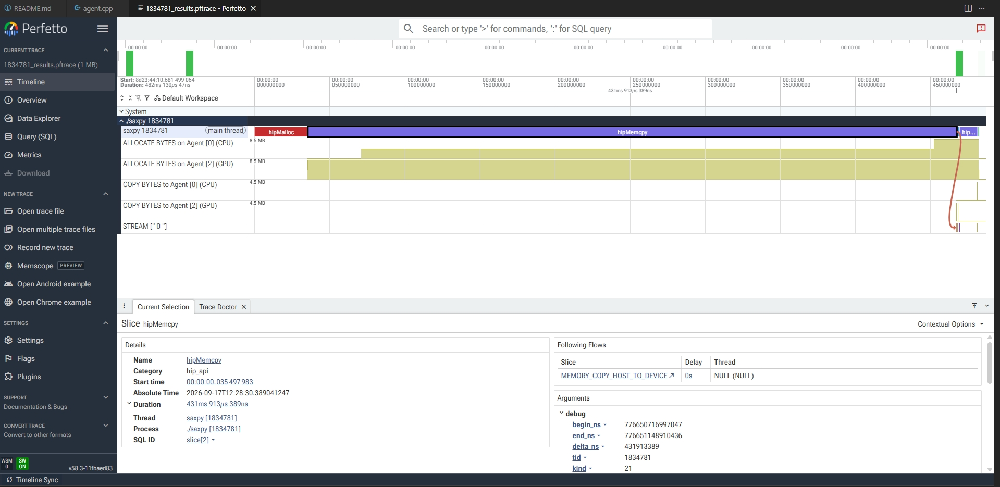

.. meta::
   :description: 初探 rocprofiler 工具
   :keywords: rocprofiler, profiler, 性能分析

##############################
rocprofiler性能分析工具
##############################

rocprofiler 介绍
==================

.. important::
    ROCProfiler、`ROCTracer <https://rocm.docs.amd.com/projects/roctracer/en/latest/index.html>`_、``rocprof`` 和 ``rocprofv2`` 均已废弃。强烈建议升级至最新版
    `ROCprofiler-SDK <https://rocm.docs.amd.com/projects/rocprofiler-sdk/en/latest/install/installation.html>`_
    库以及 `rocprofv3 <https://rocm.docs.amd.com/projects/rocprofiler-sdk/en/latest/how-to/using-rocprofv3.html>`_ 工具，以持续获得技术支持并使用新特性。

    如需了解 ROCprofiler-SDK 相对旧版 ROCProfiler、ROCTracer 的关键特性提升与优势，请参阅
    `ROCprofiler-SDK 与传统 ROCm 分析工具对比 <https://rocm.docs.amd.com/projects/rocprofiler-sdk/en/latest/conceptual/comparing-with-legacy-tools.html>`_。

    ROCProfiler、ROCTracer、``rocprof`` 和 ``rocprofv2`` 预计将于 2026 年第二季度末停止维护（EoS）。

ROCProfiler 是 AMD 的工具基础设施，提供硬件相关的底层性能分析接口，用于对 GPU 计算应用进行性能采集与追踪。

ROCprofiler‑SDK 简介( `官方 <https://rocm.docs.amd.com/projects/rocprofiler-sdk/en/latest/>`_ )
-------------------------------------------------------------------------------------------------------------

ROCprofiler‑SDK 是一套面向 ROCm 软件平台上通用 GPU 计算应用的性能分析工具基础设施。
它支持 **应用程序追踪** ，能够完整呈现 GPU 应用的整体执行流程；同时支持 **kernel硬件计数器采集** ，可从硬件性能计数器获取底层硬件运行细节。

ROCprofiler‑SDK 库提供 **与运行时无关的 API** ，可对运行时调用、GPU 内核派发、内存拷贝等异步行为进行追踪。追踪能力包含两类接口：用于运行时 API 追踪的回调 API，以及用于记录异步行为日志的活动记录 API。

简言之，ROCprofiler‑SDK 整合了原 **ROCProfiler** 和 **ROCTracer** 两大组件。开发者可基于 ROCprofiler‑SDK 开发工具，对 ROCm 平台上的 HIP 应用做性能分析与运行追踪AMD ROCm。

本项目为开源项目，代码仓库托管于：ROCm/rocm‑systems。

.. note:: 

    ROCm 7.0 及更早版本的 ROCprofiler‑SDK 仓库地址为：ROCm/rocprofiler‑SDK。

ROCprofiler‑SDK 依赖配套库 **AQLprofile**，该库负责生成性能计数器、SQ 线程追踪所需的分析命令包（AQL/PM4）。更多信息请查阅 AQLprofile 文档。

rocprofv3
--------------------------

rocprofv3 是基于 rocprofiler-sdk 库开发的命令行工具，随 ROCm 软件栈一同发布。它既可以启动应用并开启性能剖析，也可以通过 `--attach` / `--pid` / `-p` 参数挂载到已经运行的进程，实现动态性能采集。

如需查看 rocprofv3 完整命令行选项，请参阅 `rocprofv3 用户手册 <https://rocm.docs.amd.com/projects/rocprofiler-sdk/en/latest/install/install.html>`_ 。

rocprofiler 使用方法
===========================

编译
----------------------------

可以使用therock编译rocprofiler。therock详情请看《TheRock--rocm构建工具》。

使用 therock 的 Python 环境：

.. code-block:: shell

  python3 -m venv .venv
  source .venv/bin/activate

  pip install --upgrade pip
  pip install -r requirements.txt

cmake配置
++++++++++++++++++++

.. code-block:: bash

  cmake -S . -B build-debug -GNinja \
      -DTHEROCK_ENABLE_ALL=OFF \
      -DTHEROCK_ENABLE_CORE_RUNTIME=ON \
      -DTHEROCK_ENABLE_HIP_RUNTIME=ON \
      -DTHEROCK_ENABLE_ROCPROFV3=ON \
      -DTHEROCK_FLAG_INCLUDE_PROFILER=ON \
      -DBUILD_TESTING=OFF  \
      -DTHEROCK_AMDGPU_FAMILIES=gfx90a \
      -DCMAKE_BUILD_TYPE=RelWithDebInfo \
      -DROCR-Runtime_BUILD_TYPE=Debug \
      -Dhip-clr_BUILD_TYPE=Debug  \
      -DCMAKE_INSTALL_PREFIX=/workspace/TheRock/install-debug

.. list-table:: 相关编译选项
   :header-rows: 1
   :widths: 20 20

   * - 选项
     - 含义
   * - THEROCK_ENABLE_ROCPROFV3=ON	
     - 构建 ROCprofiler-SDK / rocprofv3
   * - THEROCK_FLAG_INCLUDE_PROFILER=ON
     - 保持 profiler 集成开关开启
   * - THEROCK_ENABLE_PROFILER=ON
     - 启用整个 profiler 分组，范围更大
   * - THEROCK_ENABLE_ROCPROFSYS=ON
     - 构建 rocprofiler-systems，本次不需要

编译
++++++++++++++++++++

.. code-block:: bash

  cmake --build build-debug -j$(nproc)

安装
++++++++++++++++++++

.. code-block:: bash

  cmake --install build-debug

功能验证
+++++++++++++++++++++

.. code-block:: bash

    export ROCM_ROOT="$(realpath build-gfx90a/dist/rocm)"
    export PATH="$ROCM_ROOT/bin:$ROCM_ROOT/llvm/bin:$PATH"
    export LD_LIBRARY_PATH="$ROCM_ROOT/lib${LD_LIBRARY_PATH:+:$LD_LIBRARY_PATH}"

    "$ROCM_ROOT/bin/rocminfo"
    "$ROCM_ROOT/bin/rocprofv3" --help
    "$ROCM_ROOT/bin/rocprofv3" --list-avail

使用方法
++++++++++++++++++++++

saxpy用例
~~~~~~~~~~~~~~~~~~~~~~~

.. code-block:: cpp

    #include <iostream>
    #include <hip/hip_runtime.h>

    // HIP Kernel: SAXPY
    __global__ void saxpy_kernel(float a, const float* __restrict__ x, float* __restrict__ y, int n)
    {
        int idx = blockIdx.x * blockDim.x + threadIdx.x;
        if (idx < n)
        {
            y[idx] = a * x[idx] + y[idx];
        }
    }

    int main()
    {
        const int N = 1024 * 1024; // 向量长度 1M
        const float a = 2.0f;

        // 主机内存
        float* h_x = new float[N];
        float* h_y = new float[N];

        // 初始化数据
        for (int i = 0; i < N; i++)
        {
            h_x[i] = 1.0f;
            h_y[i] = 1.0f;
        }

        // 设备内存
        float *d_x, *d_y;
        hipMalloc(&d_x, N * sizeof(float));
        hipMalloc(&d_y, N * sizeof(float));

        // 拷贝主机 -> GPU
        hipMemcpy(d_x, h_x, N * sizeof(float), hipMemcpyHostToDevice);
        hipMemcpy(d_y, h_y, N * sizeof(float), hipMemcpyHostToDevice);

        // 启动 kernel
        int block_size = 256;
        int grid_size = (N + block_size - 1) / block_size;
        saxpy_kernel<<<grid_size, block_size>>>(a, d_x, d_y, N);

        // 等待GPU完成，检查错误
        hipDeviceSynchronize();
        hipError_t err = hipGetLastError();
        if (err != hipSuccess)
        {
            std::cerr << "Kernel launch failed: " << hipGetErrorString(err) << std::endl;
            return -1;
        }

        // GPU -> 主机
        hipMemcpy(h_y, d_y, N * sizeof(float), hipMemcpyDeviceToHost);

        // 校验结果：预期 y[i] = 2*1 +1 =3
        bool ok = true;
        for (int i = 0; i < N; i++)
        {
            if (std::abs(h_y[i] - 3.0f) > 1e-5f)
            {
                ok = false;
                std::cerr << "Error at index " << i << " val=" << h_y[i] << std::endl;
                break;
            }
        }

        if (ok)
        {
            std::cout << "SAXPY passed!" << std::endl;
        }

        // 释放内存
        hipFree(d_x);
        hipFree(d_y);
        delete[] h_x;
        delete[] h_y;

        return 0;
    }

编译
~~~~~~~~~~~~~~~~~~~~~~~

.. code-block:: bash

    hipcc saxpy.hip -o saxpy

执行
~~~~~~~~~~~~~~~~~~~~~~~

使用rocprofv3分析的测试 case，脚本执行：

.. code-block:: bash

    rocprofv3 -r -d profiler_output -f pftrace -- ./saxpy

参数说明：
    -r ：开启分析，可以分析到 aica API 和 核函数运行情况
    -o：指定分析结果文件的文件名
    -d：指定分析结果文件的输出目录
    -f ：指定分析结果文件的格式，目前支持 pftrace 和 json，建议使用 pftrace 格式
    --log-level：设置 profiler 的 log 等级，支持 fatal，error，warning，info，trace，env，config
    -- ./saxpy：要分析的程序（相对于当前目录）

输出日志中，会提示生成的pftrace文件位置。

展示
~~~~~~~~~~~~~~~~~~~~~~~

1. 如果 vscode 安装了 drain99.perfetto-trace 插件，那么在上一步执行完毕后，会自动打开结果文件。因此强烈建议安装此插件。

2. 如果没有安装插件：
    打开分析网站： `perfetto <https://ui.perfetto.dev/>`_
    将分析文件下载至本地，点击分析网站左侧的 “Open trace file”，选择下载的分析文件并打开，即可看到 aica API 和核函数运行情况。

